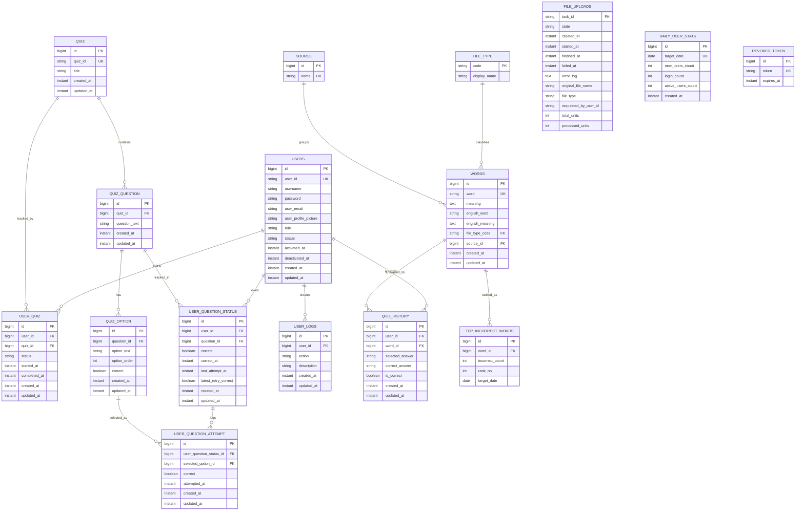

# Economy Dictionary 현재 구현 기획/운영 명세서

- 작성 기준일: 2026-03-21
- 기준 저장소: `/Users/chojunho/project/economy_dict`
- 문서 목적: 현재 구현된 기능, API 계약, 저장 구조, 운영 메모를 한 문서로 정리한 현행 명세서
- 문서 성격: 신규 기획안이 아니라 "지금 동작하는 시스템" 기준의 제품/개발 명세

## 1. 서비스 개요

Economy Dictionary는 경제 용어 사전, AI 용어 조회, 관리자 주도 퀴즈 생성, 일일 퀴즈 풀이, 오답 복습, 업로드 기반 단어 사전 구축, AI 채팅 기능을 제공하는 학습 서비스다.

현재 시스템은 다음 세 축으로 구성된다.

1. 사용자 학습 기능
2. 관리자 운영 기능
3. OpenAI 및 비동기 배치 기반 보조 기능

## 2. 기술 구성

| 구분 | 구성 |
|---|---|
| Frontend | React + Vite + TypeScript + Zustand |
| Backend | Spring Boot + Spring Security + Spring Data JPA + Spring Batch |
| DB | PostgreSQL |
| 인증 | JWT Bearer Token |
| AI | OpenAI API (`gpt-4o-mini`) |
| 파일 저장 | 업로드 임시 파일은 OS temp, 채팅은 JSON 파일 저장 |
| 운영 포트 | Backend `8081`, Nginx `4321`, Postgres host `9001` |

## 3. 현재 사용자 화면 구조

| 경로 | 화면 | 설명 |
|---|---|---|
| `/` | Home | 서비스 개요 |
| `/words` | Words | 단어 목록, 검색 |
| `/quiz` | Daily Quiz | 최신 관리자 생성 퀴즈 풀이 |
| `/incorrect-note` | Incorrect Note | 첫 시도 기준 오답 문항 복습 |
| `/top-incorrect` | Top Incorrect Words | 오답 상위 단어 조회 |
| `/chat` | AI Chat | 대화 스레드 기반 AI 채팅 |
| `/mypage` | My Page | 내 프로필 및 통계 |
| `/admin` | Admin | 관리자 대시보드 및 운영 |
| `/signin` | Sign In | 로그인 |
| `/signup` | Sign Up | 회원가입 |
| `/terms` | Terms | 약관 |

리다이렉트 경로:

- `/search` -> `/words`
- `/dictionary` -> `/words`

## 4. 핵심 기능 요약

### 4.1 인증/회원

- 회원가입
- 로그인 후 JWT 발급
- 로그아웃
- 회원 탈퇴
- 내 프로필 조회/수정
- 관리자 권한 기반 접근 제어

### 4.2 사전/검색

- 단어 목록 페이징 조회
- 단어 상세 조회
- 키워드 검색
- AI 기반 신규 용어 뜻 생성 및 저장

### 4.3 퀴즈

- 관리자가 직접 퀴즈 CRUD 가능
- 관리자가 OpenAI 기반 객관식 퀴즈 자동 생성 가능
- 사용자는 최신 관리자 생성 퀴즈를 Daily Quiz로 풀이
- 한 문제씩 정답을 맞춰야 다음 문제로 이동
- 틀리면 같은 문제를 다시 풀고, 첫 시도 결과만 공식 기록
- 퀴즈 종료 후 첫 시도 기준 정답 수/오답 수 제공
- 전체 다시 풀기 및 오답만 다시 풀기 가능
- 오답노트에서 틀린 문제 재진입 가능

### 4.4 오답/통계

- 문항 오답노트는 `user_question_status` + `user_question_attempt` 기준
- 퀴즈 공식 성적은 "첫 시도" 기준으로 계산
- 재풀이 최신 결과는 `latestRetryCorrect`에 별도 저장
- 오답 상위 단어는 아직 레거시 `quiz_history` 기준 집계
- 마이페이지 학습 수/정답률도 현재는 레거시 `quiz_history` 기준

### 4.5 업로드/사전 구축

- 관리자가 `pdf`, `txt`, `xlsx`, `csv`, `json`, `zip` 업로드 가능
- 비동기 배치 작업으로 단어 추출/적재
- 업로드 상태, 진행률, 파일명, 에러 로그 조회 가능

### 4.6 관리자 운영

- 사용자 CRUD 및 역할 변경
- 단어 CRUD
- 단어 출처/파일 타입 관리용 조회
- 영어 번역 일괄 생성
- 업로드 작업 모니터링
- 퀴즈/문항/보기 CRUD
- AI 퀴즈 생성
- 일별 유저 통계
- 요약 수치 조회
- 퀴즈별 참가자 및 문항별 정답률 조회

### 4.7 AI 채팅

- 사용자별 대화 스레드 생성
- 스레드 목록/상세 조회
- 메시지 추가 시 OpenAI 응답 생성
- 스레드 JSON 파일 저장

## 5. 인증/권한 정책

### 5.1 인증 방식

- JWT Bearer 토큰 사용
- 요청 헤더: `Authorization: Bearer {accessToken}`
- 로그인 응답에서 `accessToken` 반환

### 5.2 공개 접근 가능 API

- `GET /api/health`
- `POST /api/token`
- `POST /api/signup`
- `GET /api/search`
- `POST /api/auth/signup`
- `POST /api/auth/login`
- `GET /api/words`
- `GET /api/words/**`
- `GET /api/search`
- `GET /api/quizzes/top-100`

### 5.3 인증 필요 API

- 위 공개 API를 제외한 대부분의 `/api/**`

### 5.4 관리자 전용 API

- `/api/admin/**`
- `GET /api/quizzes/{quizId}/participants`

## 6. 기능 상세 기획

### 6.1 회원가입/로그인

- 회원가입 시 `userId`, `username`, `password`는 필수
- 로그인 성공 시 JWT와 역할 정보 반환
- 로그아웃 시 전달된 토큰을 폐기 토큰 목록에 기록
- 탈퇴 시 사용자는 `DEACTIVATED` 상태로 전환

### 6.2 단어 사전

- 기본 단어 목록은 `words` 테이블 조회
- 검색은 `word`, `meaning` 부분 일치 기반
- `lookup` 또는 `search`에서 DB에 정의가 없으면 OpenAI로 뜻을 생성
- AI로 생성된 단어는 `file_type = AI_LOOKUP`으로 저장

### 6.3 Daily Quiz 동작 규칙

- Daily Quiz는 가장 최근에 생성된 관리자 퀴즈 1개를 사용
- 문제는 한 번에 1개만 노출
- 사용자가 맞춰야 다음 문제로 이동
- 사용자가 틀리면 같은 문제를 다시 풀어야 함
- 공식 성적은 각 문항의 첫 시도만 반영
- 이미 맞힌 문제는 새로고침 후 `solvedQuestionIds`로 건너뛸 수 있음
- 모든 문제 풀이 후 공식 기록 기준 정답 수/오답 수를 표시

### 6.4 재풀이/오답노트

- 모든 문제 다시 풀기 가능
- 첫 시도에서 틀린 문제만 다시 풀기 가능
- 오답노트 페이지에서 개별 문항 재진입 가능
- 첫 시도 결과는 유지
- 재풀이 최신 정오답은 `user_question_status.latest_retry_correct`에 덮어씀
- 이 값은 향후 기능 확장용이며, 현재 화면 주요 지표에는 직접 사용하지 않음

### 6.5 관리자 AI 퀴즈 생성

- 단어 후보는 `words` 테이블에서 `word`, `meaning`이 모두 있는 데이터만 사용
- 최대 10문항 생성
- 문항마다 정답 1개 + 오답 후보 최대 3개로 4지선다 구성
- 보기 생성 후 DB 저장 시 4개 보기를 섞어 저장
- Daily Quiz 응답 시에도 현재는 응답용 셔플 로직이 존재
- OpenAI 응답이 누락되거나 유효한 4개 보기를 만들지 못하면 생성 실패 처리

### 6.6 오답 상위 단어

- 현재는 질문 기반 Daily Quiz가 아니라 레거시 `quiz_history` 기반 집계
- 매일 새벽 집계 스케줄이 `top_incorrect_words`를 갱신
- 따라서 Daily Quiz의 현재 문항형 오답 기록과 완전히 동일한 기준은 아님

### 6.7 사용자 통계

- 마이페이지의 `learnedWordCount`, `correctRate`는 현재 `quiz_history` 기반
- 질문형 Daily Quiz의 `user_question_attempt` 집계와는 분리되어 있음

## 7. API 명세

기본 규칙:

- Base URL: Backend 기준 `http://localhost:8081`
- 인증 필요 시 `Authorization: Bearer {token}`
- 에러는 구조화된 JSON 응답 사용

표기 규칙:

- Auth: `Public`, `User`, `Admin`
- 주요 에러: 실제 구현상 대표적인 에러를 기재

---

## 7.1 Health

### `GET /api/health`

| 항목 | 내용 |
|---|---|
| Auth | Public |
| 목적 | 헬스체크 |
| 요청 | 없음 |
| 응답 | 간단한 상태 응답 |

---

## 7.2 인증/회원 API

### `POST /api/auth/signup`

| 항목 | 내용 |
|---|---|
| Auth | Public |
| 목적 | 회원가입 |

Request Body:

| 필드 | 타입 | 필수 | 설명 |
|---|---|---|---|
| `userId` | string | Y | 3~50자 |
| `username` | string | Y | 2~100자 |
| `password` | string | Y | 8~100자 |
| `email` | string | N | 이메일 형식 |
| `profilePicture` | string | N | 프로필 이미지 URL 또는 문자열 |

Response Body: `UserProfileDto`

| 필드 | 타입 | 설명 |
|---|---|---|
| `userId` | string | 로그인 ID |
| `username` | string | 사용자명 |
| `email` | string | 이메일 |
| `profilePicture` | string | 프로필 이미지 |
| `role` | enum | `GENERAL` 또는 `ADMIN` |
| `status` | enum | `ACTIVE` 또는 `DEACTIVATED` |
| `activatedAt` | datetime | 활성화 시각 |
| `deactivatedAt` | datetime | 비활성화 시각 |

주요 에러:

- 중복 `userId`
- 유효성 검증 실패

### `POST /api/auth/login`

| 항목 | 내용 |
|---|---|
| Auth | Public |
| 목적 | 로그인 후 JWT 발급 |

Request Body:

| 필드 | 타입 | 필수 | 설명 |
|---|---|---|---|
| `userId` | string | Y | 로그인 ID |
| `password` | string | Y | 비밀번호 |

Response Body: `AuthResponse`

| 필드 | 타입 | 설명 |
|---|---|---|
| `accessToken` | string | JWT |
| `tokenType` | string | 일반적으로 `Bearer` |
| `role` | enum | 사용자 역할 |

### `POST /api/auth/logout`

| 항목 | 내용 |
|---|---|
| Auth | User |
| 목적 | 현재 토큰 로그아웃 처리 |

요청 헤더:

| 헤더 | 필수 | 설명 |
|---|---|---|
| `Authorization` | N | 있으면 `Bearer {token}` 형태 |

Response:

- `200 OK`
- 본문 없음

### `DELETE /api/withdraw`

| 항목 | 내용 |
|---|---|
| Auth | User |
| 목적 | 현재 사용자 탈퇴 처리 |

Response:

- `204 No Content`

### 레거시 호환 엔드포인트

- `POST /api/signup` -> `POST /api/auth/signup`
- `POST /api/token` -> `POST /api/auth/login`
- `POST /api/logout` -> `POST /api/auth/logout`

### `GET /api/users/me`

| 항목 | 내용 |
|---|---|
| Auth | User |
| 목적 | 내 프로필 조회 |

Response Body: `UserProfileDto`

추가 통계 필드:

| 필드 | 타입 | 설명 |
|---|---|---|
| `learnedWordCount` | long | 레거시 `quiz_history` 기준 학습 건수 |
| `correctRate` | double | 레거시 `quiz_history` 기준 정답률(%) |

### `PUT /api/users/me`

| 항목 | 내용 |
|---|---|
| Auth | User |
| 목적 | 내 프로필 수정 |

Request Body:

| 필드 | 타입 | 필수 | 설명 |
|---|---|---|---|
| `username` | string | N | 2~100자 |
| `password` | string | N | 8~100자 |
| `email` | string | N | 이메일 |
| `profilePicture` | string | N | 프로필 이미지 |

Response Body: `UserProfileDto`

### `DELETE /api/users/me`

| 항목 | 내용 |
|---|---|
| Auth | User |
| 목적 | 내 계정 비활성화 |

Response:

- `204 No Content`

---

## 7.3 단어/검색 API

### `GET /api/words`

| 항목 | 내용 |
|---|---|
| Auth | Public |
| 목적 | 단어 목록 페이징 조회 |

Query Parameters:

| 파라미터 | 타입 | 기본값 | 설명 |
|---|---|---|---|
| `q` | string | 없음 | 단어/뜻 검색어 |
| `page` | int | `0` | 페이지 번호 |
| `size` | int | `12` | 페이지 크기 |

Response Body: `PagedResponse<WordResponse>`

`WordResponse` 필드:

| 필드 | 타입 | 설명 |
|---|---|---|
| `id` | long | 단어 PK |
| `word` | string | 한글 용어 |
| `meaning` | string | 뜻 |
| `englishWord` | string | 영문 용어 |

`PagedResponse` 공통 필드:

| 필드 | 타입 | 설명 |
|---|---|---|
| `content` | array | 데이터 목록 |
| `page` | int | 현재 페이지 |
| `size` | int | 페이지 크기 |
| `totalElements` | long | 전체 개수 |
| `totalPages` | int | 전체 페이지 수 |

### `GET /api/words/{id}`

| 항목 | 내용 |
|---|---|
| Auth | Public |
| 목적 | 단어 상세 조회 |

Response Body: `WordResponse`

### `GET /api/words/lookup?q={term}`

| 항목 | 내용 |
|---|---|
| Auth | Public |
| 목적 | 단어 검색 후 없으면 OpenAI로 뜻 생성 |

동작 규칙:

- DB에 정의가 있으면 기존 데이터 반환
- 뜻이 비어 있거나 단어가 없으면 OpenAI 호출
- 생성 성공 시 DB 저장 후 반환
- 저장 시 `file_type = AI_LOOKUP`

### `GET /api/search?q={term}`

| 항목 | 내용 |
|---|---|
| Auth | Public |
| 목적 | 간단 검색 응답 |

Response Body: `SearchResponse`

| 필드 | 타입 | 설명 |
|---|---|---|
| `word` | string | 용어 |
| `meaning` | string | 뜻 |
| `englishWord` | string | 영문 용어 |

### `GET /api/dictionary`

| 항목 | 내용 |
|---|---|
| Auth | Public |
| 목적 | 레거시 사전 검색 API |

Query Parameters:

| 파라미터 | 타입 | 설명 |
|---|---|---|
| `q` | string | 포함 검색 |

Response Body: `DictionaryEntryDto[]`

### `POST /api/dictionary`

| 항목 | 내용 |
|---|---|
| Auth | Admin |
| 목적 | 레거시 사전 생성 API |

Request Body: `DictionaryEntryDto`

---

## 7.4 퀴즈 API

### `GET /api/quizzes`

| 항목 | 내용 |
|---|---|
| Auth | User |
| 목적 | 퀴즈 목록 조회 |

Response Body: `QuizDto[]`

`QuizDto` 필드:

| 필드 | 타입 | 설명 |
|---|---|---|
| `quizId` | string | UUID |
| `title` | string | 제목 |
| `questions` | array | 상세 조회 시 포함 |

### `GET /api/quizzes/{quizId}`

| 항목 | 내용 |
|---|---|
| Auth | User |
| 목적 | 특정 퀴즈 상세 조회 |

Response Body: `QuizDto`

`QuizQuestionDto` 필드:

| 필드 | 타입 | 설명 |
|---|---|---|
| `id` | long | 문제 ID |
| `questionText` | string | 문제 문장 |
| `options` | array | 보기 목록 |

`QuizOptionDto` 필드:

| 필드 | 타입 | 설명 |
|---|---|---|
| `id` | long | 보기 ID |
| `optionText` | string | 보기 텍스트 |
| `optionOrder` | int | 저장된 순서 |

### `POST /api/quizzes/{quizId}/submit`

| 항목 | 내용 |
|---|---|
| Auth | User |
| 목적 | 퀴즈 답안 제출 |

Request Body: `QuizSubmitRequest`

| 필드 | 타입 | 필수 | 설명 |
|---|---|---|---|
| `answers` | array | Y | 제출 답안 목록 |

`answers[]` 원소:

| 필드 | 타입 | 필수 | 설명 |
|---|---|---|---|
| `questionId` | long | Y | 문제 ID |
| `selectedOptionId` | long | Y | 선택한 보기 ID |

Response Body: `QuizSubmitResponse`

| 필드 | 타입 | 설명 |
|---|---|---|
| `totalQuestions` | int | 퀴즈 총 문항 수 |
| `correctCount` | long | 현재까지 맞힌 문항 수 |
| `completed` | boolean | 모든 문항을 맞혔는지 여부 |
| `submittedCorrect` | boolean | 이번 제출이 정답인지 여부 |
| `recordedCorrectCount` | long | 첫 시도 기준 맞은 문항 수 |
| `recordedIncorrectCount` | long | 첫 시도 기준 틀린 문항 수 |

저장 규칙:

- `user_quiz`에 사용자별 퀴즈 진행 상태 기록
- `user_question_status`에 문항별 대표 상태 기록
- `user_question_attempt`에 모든 시도 로그 저장
- 첫 시도 결과는 이후 재풀이로 덮어쓰지 않음
- 두 번째 시도부터는 `latestRetryCorrect`를 갱신

### `GET /api/quizzes/{quizId}/participants`

| 항목 | 내용 |
|---|---|
| Auth | Admin |
| 목적 | 해당 퀴즈 참여 사용자 목록 조회 |

Response Body:

- `string[]` (`userId` 배열)

---

## 7.5 학습형 Daily Quiz API

### `GET /api/quizzes/daily`

| 항목 | 내용 |
|---|---|
| Auth | User |
| 목적 | 최신 관리자 생성 퀴즈를 Daily Quiz 형태로 조회 |

Response Body: `DailyQuizResponse`

| 필드 | 타입 | 설명 |
|---|---|---|
| `quizId` | string | Daily Quiz 대상 퀴즈 UUID |
| `title` | string | 퀴즈 제목 |
| `questions` | array | 문제 목록 |
| `solvedQuestionIds` | long[] | 이미 맞춘 문항 ID |
| `recordedCorrectCount` | long | 첫 시도 기준 정답 수 |
| `recordedIncorrectCount` | long | 첫 시도 기준 오답 수 |

`questions[]` 원소: `DailyQuizQuestionResponse`

| 필드 | 타입 | 설명 |
|---|---|---|
| `questionId` | long | 문제 ID |
| `questionText` | string | 문제 텍스트 |
| `options` | array | 보기 목록 |

`options[]` 원소: `DailyQuizOptionResponse`

| 필드 | 타입 | 설명 |
|---|---|---|
| `optionId` | long | 보기 ID |
| `optionText` | string | 보기 텍스트 |

운영 메모:

- 최신 `quiz.createdAt` 기준 1개 퀴즈를 선택
- 보기 배열은 응답 생성 시 셔플 로직을 적용
- 공식 성적은 `user_question_attempt`의 첫 시도 기준

### `POST /api/quizzes/submit`

| 항목 | 내용 |
|---|---|
| Auth | User |
| 목적 | 사용 금지된 레거시 제출 경로 안내 |

동작:

- 항상 예외 발생
- 메시지: `/api/quizzes/{quizId}/submit` 사용 안내

### `GET /api/quizzes/incorrect`

| 항목 | 내용 |
|---|---|
| Auth | User |
| 목적 | 첫 시도에서 틀린 문항 목록 조회 |

Response Body: `IncorrectQuizQuestionResponse[]`

| 필드 | 타입 | 설명 |
|---|---|---|
| `questionId` | long | 문제 ID |
| `quizId` | string | 원본 퀴즈 UUID |
| `quizTitle` | string | 원본 퀴즈 제목 |
| `questionText` | string | 문제 문장 |
| `options` | array | 다시 풀기용 보기 |

정렬 규칙:

- 첫 오답 시도 시각 내림차순
- 동률이면 `questionId` 오름차순

### `GET /api/quizzes/top-100`

| 항목 | 내용 |
|---|---|
| Auth | Public |
| 목적 | 오답 상위 100개 단어 조회 |

Response Body: `TopIncorrectWordResponse[]`

| 필드 | 타입 | 설명 |
|---|---|---|
| `rank` | int | 순위 |
| `wordId` | long | 단어 ID |
| `term` | string | 용어 |
| `incorrectCount` | int | 오답 횟수 |
| `definition` | string | 뜻 |

주의:

- 현재 집계 원본은 `quiz_history`
- Daily Quiz 문항형 기록과 직접 동일하지 않음

---

## 7.6 AI 채팅 API

### `GET /api/chats`

| 항목 | 내용 |
|---|---|
| Auth | User |
| 목적 | 내 채팅 스레드 목록 조회 |

Response Body: `ChatThreadSummaryResponse[]`

| 필드 | 타입 | 설명 |
|---|---|---|
| `threadId` | string | 스레드 UUID |
| `title` | string | 제목 |
| `createdAt` | datetime | 생성 시각 |
| `updatedAt` | datetime | 수정 시각 |
| `messageCount` | int | 메시지 수 |

### `POST /api/chats`

| 항목 | 내용 |
|---|---|
| Auth | User |
| 목적 | 새 채팅 스레드 생성 |

Request Body: `ChatThreadCreateRequest`

| 필드 | 타입 | 필수 | 설명 |
|---|---|---|---|
| `title` | string | N | 없으면 `새 대화` |

Response Body: `ChatThreadResponse`

### `GET /api/chats/{threadId}`

| 항목 | 내용 |
|---|---|
| Auth | User |
| 목적 | 특정 스레드 상세 조회 |

Response Body: `ChatThreadResponse`

`ChatThreadResponse` 필드:

| 필드 | 타입 | 설명 |
|---|---|---|
| `threadId` | string | 스레드 UUID |
| `title` | string | 제목 |
| `createdAt` | datetime | 생성 시각 |
| `updatedAt` | datetime | 수정 시각 |
| `messages` | array | 메시지 목록 |

`messages[]` 원소:

| 필드 | 타입 | 설명 |
|---|---|---|
| `role` | string | `user` 또는 `assistant` |
| `content` | string | 메시지 내용 |
| `createdAt` | datetime | 생성 시각 |

### `POST /api/chats/{threadId}/messages`

| 항목 | 내용 |
|---|---|
| Auth | User |
| 목적 | 메시지 추가 및 AI 응답 생성 |

Request Body:

| 필드 | 타입 | 필수 | 설명 |
|---|---|---|---|
| `message` | string | Y | 사용자 메시지 |

동작:

- 스레드에 사용자 메시지 추가
- 제목이 기본값이면 첫 질문 기반으로 제목 요약
- OpenAI 호출
- assistant 메시지 추가
- 스레드 JSON 파일 저장

Response Body: `ChatThreadResponse`

### `DELETE /api/chats/{threadId}`

| 항목 | 내용 |
|---|---|
| Auth | User |
| 목적 | 스레드 삭제 |

Response:

- `204 No Content`

---

## 7.7 관리자 API

모든 관리자 API는 `Auth = Admin`이다.

### 7.7.1 사용자 관리

#### `GET /api/admin/users`

- 목적: 사용자 목록 조회
- 응답: `AdminUserDto[]`

`AdminUserDto` 필드:

| 필드 | 타입 | 설명 |
|---|---|---|
| `id` | long | 내부 PK |
| `userId` | string | 로그인 ID |
| `username` | string | 이름 |
| `email` | string | 이메일 |
| `profilePicture` | string | 프로필 이미지 |
| `role` | enum | `GENERAL`, `ADMIN` |
| `status` | enum | `ACTIVE`, `DEACTIVATED` |
| `activatedAt` | datetime | 활성화 시각 |
| `deactivatedAt` | datetime | 비활성화 시각 |

#### `PATCH /api/admin/users/{id}/role`

- 목적: 사용자 역할 변경

Request Body:

| 필드 | 타입 | 필수 | 설명 |
|---|---|---|---|
| `role` | enum | Y | `GENERAL` 또는 `ADMIN` |

응답: `AdminUserDto`

#### `POST /api/admin/users`

- 목적: 사용자 생성

Request Body: `AdminUserRequest`

| 필드 | 타입 | 필수 | 설명 |
|---|---|---|---|
| `userId` | string | Y | 3~50자 |
| `username` | string | Y | 2~100자 |
| `password` | string | N | 없으면 `changeme123` |
| `email` | string | N | 이메일 |
| `profilePicture` | string | N | 이미지 |
| `role` | enum | N | 없으면 엔티티 기본값 사용 |
| `status` | enum | N | 없으면 `ACTIVE` |

응답: `AdminUserDto`

#### `PUT /api/admin/users/{id}`

- 목적: 사용자 수정
- 요청 형식: `AdminUserRequest`
- 응답: `AdminUserDto`

#### `DELETE /api/admin/users/{id}`

- 목적: 사용자 삭제
- 응답: `204 No Content`

### 7.7.2 통계

#### `GET /api/admin/stats/daily`

- 목적: 최근 일별 사용자 통계 조회
- 선행 동작: `refreshDailyStats()`, `refreshTopIncorrectWords()` 실행
- 응답: `DailyUserStatResponse[]`

`DailyUserStatResponse` 필드:

| 필드 | 타입 | 설명 |
|---|---|---|
| `targetDate` | date | 기준일 |
| `newUsersCount` | int | 신규 가입자 수 |
| `loginCount` | int | 로그인 수 |
| `activeUsersCount` | int | 활동 사용자 수 |
| `createdAt` | datetime | 집계 생성 시각 |

#### `GET /api/admin/stats/summary`

- 목적: 관리자 대시보드 요약 수치 조회

Response Body:

| 필드 | 타입 | 설명 |
|---|---|---|
| `totalUsers` | long | 전체 사용자 수 |
| `activeUsers` | long | 활성 사용자 수 |
| `totalWords` | long | 전체 단어 수 |
| `recentUploads` | long | 최근 업로드 작업 수 |

### 7.7.3 단어/사전 관리

#### `GET /api/admin/words?page={page}&size={size}`

- 목적: 관리자 단어 목록 페이징 조회
- 응답: `PagedResponse<DictionaryEntryDto>`

`DictionaryEntryDto` 필드:

| 필드 | 타입 | 설명 |
|---|---|---|
| `id` | long | 단어 PK |
| `word` | string | 한글 용어 |
| `meaning` | string | 뜻 |
| `englishWord` | string | 영문 용어 |
| `englishMeaning` | string | 영문 뜻 |
| `fileType` | string | 파일 타입 코드 |
| `sourceId` | long | 출처 ID |
| `sourceName` | string | 출처명 |

#### `GET /api/admin/sources`

- 목적: 단어 출처 선택지 조회
- 응답: `SourceOptionDto[]`

#### `GET /api/admin/file-types`

- 목적: 파일 타입 선택지 조회
- 응답: `FileTypeOptionDto[]`

#### `POST /api/admin/words`

- 목적: 단어 생성
- 요청: `DictionaryEntryDto`
- 응답: `DictionaryEntryDto`

#### `PUT /api/admin/words/{id}`

- 목적: 단어 수정
- 요청: `DictionaryEntryDto`
- 응답: `DictionaryEntryDto`

#### `DELETE /api/admin/words/{id}`

- 목적: 단어 삭제
- 응답: `204 No Content`

#### `POST /api/admin/words/to-english`

- 목적: 전체 단어에 대해 OpenAI 기반 영문 용어/영문 뜻 생성

Response Body: `AdminEnglishTranslationResponse`

| 필드 | 타입 | 설명 |
|---|---|---|
| `processedCount` | int | 전체 처리 수 |
| `updatedCount` | int | 실제 갱신 수 |
| `skippedCount` | int | 스킵 수 |
| `failedCount` | int | 실패 수 |

### 7.7.4 업로드/배치

#### `POST /api/admin/words/upload`

- 목적: 단어 파일 업로드 및 비동기 적재 작업 생성
- Content-Type: `multipart/form-data`

Form Fields:

| 필드 | 타입 | 필수 | 설명 |
|---|---|---|---|
| `file` | file | Y | 업로드 파일 |
| `sourceId` | long | N | 기존 출처 ID |
| `sourceName` | string | N | 신규 또는 보조 출처명 |

지원 확장자:

- `pdf`
- `txt`
- `xlsx`
- `csv`
- `json`
- `zip`

제한:

- 최대 업로드 크기 `20MB`

Response Body: `WordUploadStatusResponse`

| 필드 | 타입 | 설명 |
|---|---|---|
| `fileId` | string | 작업 ID |
| `originalFileName` | string | 원본 파일명 |
| `status` | string | 작업 상태 |
| `message` | string | 상태 메시지 |
| `estimatedTime` | string | 예상 시간 |
| `progressPercent` | double | 진행률 |
| `errorLog` | string | 에러 로그 |

#### `GET /api/admin/words/upload/{taskId}`

- 목적: 단일 업로드 작업 상태 조회
- 응답: `WordUploadStatusResponse`

#### `GET /api/admin/words/uploads`

- 목적: 최근 업로드 작업 목록 조회
- 응답: `WordUploadStatusResponse[]`

#### 레거시 업로드 API

- `POST /api/admin/dictionary/import-pdf`
- `GET /api/admin/tasks/{taskId}`

`GET /api/admin/tasks/{taskId}` 응답: `ImportTaskResponse`

| 필드 | 타입 | 설명 |
|---|---|---|
| `taskId` | string | 작업 ID |
| `state` | enum | `READY`, `STARTED`, `PENDING`, `FINISHED`, `FAILED` |
| `createdAt` | datetime | 생성 시각 |
| `startedAt` | datetime | 시작 시각 |
| `finishedAt` | datetime | 완료 시각 |
| `failedAt` | datetime | 실패 시각 |
| `errorLog` | string | 에러 로그 |
| `originalFileName` | string | 원본 파일명 |
| `totalUnits` | int | 총 단위 수 |
| `processedUnits` | int | 처리 단위 수 |
| `progressPercent` | double | 진행률 |

### 7.7.5 퀴즈 관리

#### `GET /api/admin/quizzes`

- 목적: 관리자 퀴즈 목록 조회
- 응답: `AdminQuizDto[]`

`AdminQuizDto` 필드:

| 필드 | 타입 | 설명 |
|---|---|---|
| `id` | long | 내부 PK |
| `quizId` | string | 외부 UUID |
| `title` | string | 제목 |
| `questionCount` | int | 문항 수 |
| `participantCount` | int | 참여자 수 |
| `createdAt` | datetime | 생성 시각 |
| `questions` | array | 상세 조회 시 포함 |

#### `GET /api/admin/quizzes/{id}`

- 목적: 퀴즈 상세 조회
- 응답: `AdminQuizDto`

상세 문항(`AdminQuestionDto`) 필드:

| 필드 | 타입 | 설명 |
|---|---|---|
| `id` | long | 문항 PK |
| `quizId` | long | 내부 퀴즈 PK |
| `questionText` | string | 문제 문장 |
| `attemptedUsers` | long | 시도 사용자 수 |
| `correctUsers` | long | 정답 사용자 수 |
| `correctRate` | double | 정답률 |
| `participants` | string[] | 시도 사용자 ID 목록 |
| `correctParticipants` | string[] | 정답 사용자 ID 목록 |
| `options` | array | 보기 목록 |

상세 보기(`AdminOptionDto`) 필드:

| 필드 | 타입 | 설명 |
|---|---|---|
| `id` | long | 보기 PK |
| `questionId` | long | 문항 PK |
| `optionText` | string | 보기 문구 |
| `optionOrder` | int | 저장 순서 |
| `correct` | boolean | 정답 여부 |
| `selectedCount` | long | 현재 구현상 0 세팅 |

#### `POST /api/admin/quizzes/generate`

- 목적: OpenAI 기반 관리자 퀴즈 자동 생성
- 요청: 없음
- 응답: `AdminQuizDto`

생성 규칙:

- `words`에서 뜻이 있는 단어만 후보
- 최대 10문항
- 문항별 오답 후보 풀 최대 5개 사용
- 유효한 보기 4개를 확보하지 못하면 실패
- 제목 형식: `AI Quiz yyyy-MM-dd HH:mm` (Asia/Seoul)

#### `POST /api/admin/quizzes`

- 목적: 빈 퀴즈 생성

Request Body:

| 필드 | 타입 | 필수 | 설명 |
|---|---|---|---|
| `title` | string | Y | 2~200자 |

응답: `AdminQuizDto`

#### `PUT /api/admin/quizzes/{id}`

- 목적: 퀴즈 제목 수정
- 요청: `AdminQuizRequest`
- 응답: `AdminQuizDto`

#### `DELETE /api/admin/quizzes/{id}`

- 목적: 퀴즈 삭제
- 응답: `204 No Content`

### 7.7.6 문항 관리

#### `GET /api/admin/questions`

- 목적: 전체 문항 목록 조회
- 응답: `AdminQuestionDto[]`

#### `POST /api/admin/questions`

- 목적: 문항 생성

Request Body:

| 필드 | 타입 | 필수 | 설명 |
|---|---|---|---|
| `quizId` | long | Y | 내부 퀴즈 PK |
| `questionText` | string | Y | 2~500자 |

응답: `AdminQuestionDto`

#### `PUT /api/admin/questions/{id}`

- 목적: 문항 수정
- 요청: `AdminQuestionRequest`
- 응답: `AdminQuestionDto`

#### `DELETE /api/admin/questions/{id}`

- 목적: 문항 삭제
- 응답: `204 No Content`

### 7.7.7 보기 관리

#### `GET /api/admin/options`

- 목적: 전체 보기 목록 조회
- 응답: `AdminOptionDto[]`

#### `POST /api/admin/options`

- 목적: 보기 생성

Request Body:

| 필드 | 타입 | 필수 | 설명 |
|---|---|---|---|
| `questionId` | long | Y | 문항 PK |
| `optionText` | string | Y | 1~300자 |
| `optionOrder` | int | N | 정렬 순서 |
| `correct` | boolean | N | 정답 여부 |

응답: `AdminOptionDto`

#### `PUT /api/admin/options/{id}`

- 목적: 보기 수정
- 요청: `AdminOptionRequest`
- 응답: `AdminOptionDto`

#### `DELETE /api/admin/options/{id}`

- 목적: 보기 삭제
- 응답: `204 No Content`

### 7.7.8 레거시 사전 CRUD

- `GET /api/admin/dictionary`
- `POST /api/admin/dictionary`
- `PUT /api/admin/dictionary/{id}`
- `DELETE /api/admin/dictionary/{id}`

현재 `/api/admin/words` 계열과 기능이 중복된다.

## 8. DB 구조

## 8.1 ER Diagram

보조 저장소:

- 채팅 스레드는 RDB 테이블이 아니라 `${app.chat.storage-path}` 아래 사용자별 JSON 파일로 저장

## 8.2 테이블별 설명

### `users`

- 서비스 사용자 기본 정보
- `user_id` 유니크
- `role`: `GENERAL`, `ADMIN`
- `status`: `ACTIVE`, `DEACTIVATED`

### `words`

- 경제 용어 사전 본문
- `word` 유니크
- 파일 업로드, 관리자 수기 입력, AI lookup 결과가 함께 저장됨

### `file_type`

- 단어 유입 경로/파일 유형 코드 사전

### `source`

- 단어 데이터 출처

### `file_uploads`

- 업로드/배치 작업 추적 테이블
- 원본 파일명 포함
- 진행률 계산용 총량/처리량 포함

### `quiz`

- 퀴즈 마스터
- 외부 노출 식별자는 `quiz_id` UUID

### `quiz_question`

- 퀴즈별 문항

### `quiz_option`

- 문항별 보기
- `correct = true`인 보기가 정답

### `user_quiz`

- 사용자별 퀴즈 진행 상태
- `(user_id, quiz_id)` 유니크

### `user_question_status`

- 사용자별 문항 대표 상태
- `(user_id, question_id)` 유니크
- `correct`: 최초 오답 후 나중에 맞추더라도 최종적으로 한 번이라도 맞췄으면 true
- `latestRetryCorrect`: 첫 시도 이후 가장 최근 재풀이 결과

### `user_question_attempt`

- 모든 문항 시도 이력 로그
- 공식 성적 계산은 첫 시도 레코드 기준

### `quiz_history`

- 레거시 단어 퀴즈 기록
- 현재 마이페이지 통계와 오답 상위 단어 집계의 원본

### `top_incorrect_words`

- 일자별 오답 상위 100개 단어 캐시

### `daily_user_stats`

- 일 단위 사용자 통계 스냅샷

### `user_logs`

- 회원가입, 로그인, 로그아웃, 검색, 퀴즈 제출 등 액션 로그

### `revoked_token`

- 로그아웃된 JWT 블랙리스트

## 9. 배치/스케줄/운영 메모

### 9.1 배치

- 업로드 작업은 Spring Batch Job으로 실행
- 업로드 요청 후 즉시 `file_uploads` 작업이 생성되고 비동기로 처리

### 9.2 스케줄

- 일별 사용자 통계 갱신: 매일 01:00 Asia/Seoul
- 오답 상위 단어 갱신: 매일 02:00 Asia/Seoul

### 9.3 저장 경로

| 항목 | 경로 |
|---|---|
| 로그 | `/app/backend/logs` |
| 오류 로그 저장 경로 | `/app/backend/logs` |
| 채팅 저장 경로 | `/app/backend/chats` |

### 9.4 설정값

| 항목 | 값 |
|---|---|
| JPA DDL | `update` |
| Batch schema init | `always` |
| 최대 파일 업로드 | `20MB` |
| OpenAI Base URL | `https://api.openai.com` |
| OpenAI Model | `gpt-4o-mini` |
| JWT 만료 | `86400000ms` |

## 10. 현재 구현상 주의사항

1. `Daily Quiz`의 공식 점수는 질문형 신규 구조(`user_question_attempt`)를 사용한다.
2. `My Page` 통계와 `Top Incorrect Words`는 아직 레거시 `quiz_history` 기반이다.
3. 따라서 퀴즈 화면상의 정오답 경험과 통계 화면 숫자가 완전히 동일하지 않을 수 있다.
4. 관리자 퀴즈는 최신 1개만 Daily Quiz로 노출된다.
5. 채팅 데이터는 DB가 아니라 파일 저장이므로 백업/이관 정책을 별도로 고려해야 한다.

## 11. 향후 확장 포인트

1. `latestRetryCorrect`를 활용한 재학습 성과 분석
2. `Top Incorrect Words`를 질문형 퀴즈 기록과 통합
3. 마이페이지 통계를 `user_question_attempt` 기준으로 재정의
4. Daily Quiz 응답 셔플 규칙과 저장 순서의 완전 분리
5. 관리자 리포트에 보기별 선택 수(`selectedCount`) 실제 집계 반영

